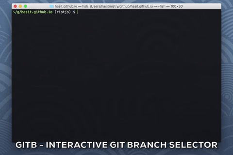

# gitb
Easy interactive local git branch selector for your terminal.



## Installing

```
go get github.com/hasit/gitb
```

## Using

Once you have successfully installed `gitb`, it will put an executable binary in your `$GOPATH/bin` folder. If you have `$GOPATH/bin` in your shell's `$PATH`, you are good to go. If not, do it! Read the section on [The GOPATH environment variable](https://golang.org/doc/code.html#GOPATH) for more information. 

You can call `gitb` from any local git repository. 

```
gitb
```

## Contributing

Feel free to ask questions, post issues and open pull requests. My only requirement is that you run `gofmt` on your code before you send in a PR. Yes.

Todo:
1. Finish writing tes
